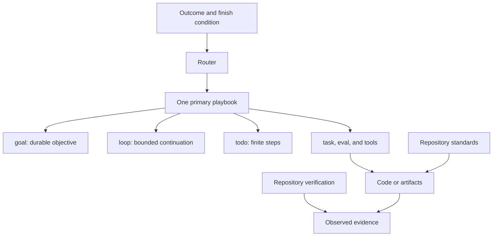

# Mental model

Eng Mode separates outcome, execution, policy, and proof.

`goal` retains the objective across turns. `loop` repeats bounded work. `todo` tracks finite steps. Completing a step or iteration does not complete the goal.

A playbook owns an end-to-end route such as investigation, bug fix, feature, refactoring, performance, or delivery. A skill is a focused method inside it. State the problem. Name a method only to override routing.

Eng Mode ships 23 principle skills. `/eng-mode` loads a leaf only when it governs a decision. Invoke `/principle-<name>` directly when you want that leaf alone. Two that earn a name here: **Attack the Premise** after repeated fixes fail the same gate, and **Test Behavior, Not Implementation** so tests call the code the way users do and assert a literal result.

Eng chooses execution. The repository decides validity and proof through standing context, `project-standards`, `verify-project`, rules, domain vocabulary, and ADRs.

A normal `task` agent stays addressable through `hub`. An eval agent is one-shot; use it only with a complete brief and schema.

Complete means behavior exists, callers and docs agree, obsolete paths are gone, and proof matches the changed surface.