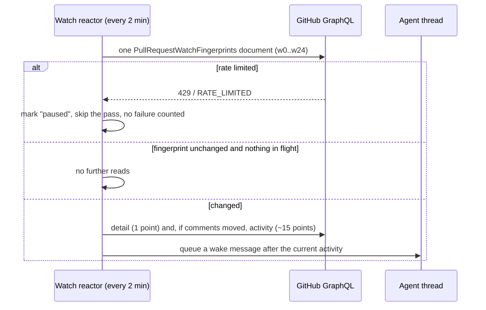

# T3 Code and GitHub

This page records the GitHub calls T3 Code made at the pinned revision and compares its rate-limit design with Eng Mode. Eng Mode has since adopted batched GraphQL reads of up to 25 PRs, fingerprint checks, credential-scoped rate-limit pauses with exit 75, and a 10% quota reserve through `eng-github`.

This is research. The "Eng Mode before eng-github" and "Recommendations at the time" sections describe the earlier `gh`, `better-github-skill`, and `pr-cockpit` workflow, which has been removed. The Adopted section lists what Eng Mode now ships.

All T3 Code paths are relative to [`pingdotgg/t3code`](https://github.com/pingdotgg/t3code) at `26285ab` (2026-10-07). Server paths start at `apps/server/src/`.

## Summary

T3 Code avoids rate limits mostly by asking GitHub less often. Retrying is a smaller part of it.

- It no longer runs `gh` for pull request work. Since 2026-10-06 the server talks to the REST and GraphQL APIs directly over HTTP. The only runtime `gh` calls left are `gh auth token` and `gh auth status`, which read credentials.
- It folds many pull requests into one GraphQL document by giving each one an alias (`s0`, `w0`, `h0` and so on). A sweep over 25 linked pull requests costs one request.
- A watched pull request is read in two steps. First a cheap batched fingerprint asks "did anything change?". The full read only happens when the answer is yes. The commit that added this reports about 90% fewer GraphQL points.
- When GitHub says "rate limited", T3 Code pauses every read for that host and credential until the reset time GitHub gave. A rate limit does not count as a failed read, so watches do not give up during one.
- Background reads stop at 10% of the GraphQL quota. That last 10% is kept for things the user clicks.

Eng Mode reads through `gh` from inside agent turns, so every read is a separate request and several requests make up one decision. Its rule against polling while a `pr-cockpit` listen is armed solves the same problem from the other side. The agent does not poll, and one long-running process does the watching.

## Transport

| Layer | File | What it does |
|---|---|---|
| Credentials | `sourceControl/GitHubCredentials.ts:136-217` | A saved settings token wins. Next comes `GH_TOKEN`, then `GITHUB_TOKEN` (enterprise hosts also need a matching `GH_HOST`), then `gh auth token --hostname H [--user A]`. Tokens from `gh` are cached for 5 minutes. A credential is fingerprinted as `host:sha256(token)`. |
| HTTP | `sourceControl/GitHubApi.ts:18-22,543-595` | Every REST and GraphQL call goes through one Effect `HttpClient`. It has a 30 second timeout and an 8 MiB body cap and sends `x-github-api-version: 2022-11-28`. At most 8 requests run at once, because GitHub's secondary limits punish bursts. |
| Classification | `sourceControl/GitHubApi.ts:310-338` | These responses count as rate limited: HTTP 429, a GraphQL error typed `RATE_LIMITED`, a GraphQL error with `x-ratelimit-remaining: 0`, a GraphQL message matching `rate limit (already )?exceeded`, and a 403 that has `remaining: 0`, a `retry-after` header or "rate limit" in the body. |
| Pause | `sourceControl/GitHubApi.ts:231-240`, `sourceControl/SourceControlRateLimit.ts:13-14` | The resume time comes from `retry-after`, else from `x-ratelimit-reset`. If GitHub gives neither, the pause backs off exponentially from 30 seconds up to 15 minutes. The pause applies to one provider, host and credential scope. |
| GraphQL budget | `sourceControl/githubGraphQlBudget.ts:10-11,68-100` | Every read document gets `rateLimit { cost limit remaining resetAt }` added to it, and the budget records what GitHub reports. A read is refused while the remaining quota, minus the expected cost, is under 10% of the limit. Requests marked `allowReserve` may use that last 10%. Mutations are never changed or refused. |

## Manifest

### `gh` processes

| Caller | Argv | Purpose |
|---|---|---|
| `GitHubCredentials.fromGh` (`sourceControl/GitHubCredentials.ts:136-169`) | `gh auth token --hostname HOST [--user ACCOUNT]` with `GH_PROMPT_DISABLED=1`, 10 s timeout | Token for every API call. Success is cached 5 min, "not signed in" 10 s, other failures not cached. |
| Provider discovery (`sourceControl/GitHubSourceControlProvider.ts:172-176`) | `gh --version`, `gh auth status --json hosts` | Account and host picker. A `gh` older than 2.81.0, which rejects `--json`, is reported as unknown auth. |

No other runtime path spawns `gh`. Error classes are still named `GitHubCli*` and carry `command: "gh"`. Those names predate the API migration (`adc3c9327`, `649418f01`).

### Source control (`sourceControl/GitHubCli.ts`)

| Operation | Transport | Request | Batching and cache |
|---|---|---|---|
| `listPullRequestsByHead`, `listOpenPullRequests` | GraphQL | `PullRequestsByHead`, one `hN: repository { pullRequests(headRefName, states, first) }` alias per branch. Selects number, title, url, base and head refs, `headRefOid`, state, `isDraft`, timestamps, `isCrossRepository`, head repository and owner. | A `RequestResolver` groups requests by host, repository, credential and reserve flag. Interactive requests wait 50 ms and send up to 50 aliases. Background requests wait 500 ms and send up to 25 (`:352-366`). No result cache. |
| `readPullRequest` | GraphQL | `PullRequestByNumber($owner,$name,$number)` | Single read. A branch reference goes through the head lookup above, open first and then all states. |
| `readRepository` | REST | `GET repos/{owner}/{repo}` | Clone URLs and default branch. |
| `readViewerLogin` | REST | `GET /user` | Picks `user/repos` or `orgs/{owner}/repos` when creating a repository. |
| `createRepository` | REST | `POST user/repos` or `POST orgs/{owner}/repos` | |
| `createPullRequest` | REST | `POST repos/{owner}/{repo}/pulls` with `{ base, head, title, body, maintainer_can_modify: true }` | The body is read from a file. |
| Discovery token check | REST | `GET /user` | Only when a saved or environment token exists. |
| `readLinkSubject` | REST | `GET repos/{owner}/{repo}/issues/{n}` | Titles for linked issues and PRs. 3 s timeout, 1 MB cap. |

### Pull requests (`pullRequest/GitHubPullRequestCli.ts`)

| Operation | Transport | Request | Batching and cache |
|---|---|---|---|
| `listPullRequests`, `searchPullRequests` | GraphQL | `search(query: $q, type: ISSUE, first, after)`, falling back to `repository.pullRequests(states, orderBy: CREATED_AT)` | Cursor paging, up to 100 per page. One request per page covers many repositories. |
| `listPullRequestStats` | GraphQL | `sN: repository { pullRequest(number) { additions deletions } }` | 25 aliases per document (`STAT_ALIASES_PER_REQUEST`, `:410`), 4 documents at once. |
| `getPullRequestSummary` | GraphQL | `PullRequestSummaries`, `sN` aliases with state, mergeable, `reviewDecision`, sizes, author, `latestReviews(first: 20)`, `commits(last: 1).statusCheckRollup.state`, and on github.com the stack fields | Waits 10 ms, then sends up to 25 aliases (`:417,1829-1832`). A failed document falls back to one read per PR, unless the host is paused. |
| `getPullRequestWatchFingerprint` | GraphQL | `PullRequestWatchFingerprints`, `wN` aliases (`pullRequest/gitHubPullRequestJson.ts:2163-2185`) | Same 10 ms window and 25 aliases (`:1883-1888`). The service caches results for 15 s. |
| `getPullRequestDetail` | GraphQL | `pullRequestCoreGraphQlQuery`: merge settings, `viewerPermission`, PR core, `compare` against `refs/pull/N/head`, `reviewRequests(first: 100)`, `labels(first: 100)`, check contexts with `isRequired` on github.com | One PR per request. Up to 10 extra pages of check contexts. The service caches 60 s, or 10 min for merged PRs. |
| `getPullRequestPreview` | GraphQL | `PULL_REQUEST_PREVIEW_GRAPHQL_QUERY` | Hover card. |
| `getPullRequestActivity` | GraphQL | `PULL_REQUEST_ACTIVITY_GRAPHQL_QUERY` (`gitHubPullRequestJson.ts:893-916`). Comments, reviews and head commits in one document, each part switched on by a variable | Cached 60 s. |
| `listReviewThreadComments` | GraphQL | `REVIEW_THREADS_GRAPHQL_QUERY`, plus `REVIEW_DISMISSALS_GRAPHQL_QUERY` when more dismissals exist | If enrichment fails, the conversation is shown truncated instead of failing. |
| `getReviewThreadComments` | GraphQL | `REVIEW_THREAD_COMMENTS_GRAPHQL_QUERY($threadId, $cursor)` | Remaining comments of one long thread, on demand. |
| `getPullRequestStack`, stack actions | REST and GraphQL | `GET repos/{o}/{r}/stacks?pull_request=N`, `GET .../stacks/{n}`, one aliased permission query for every open layer, `PUT pulls/N/merge-async`, poll `merge-async/{uuid}` (`githubStackActions.ts:254-276`) | The merge poll backs off 1, 2, 4 and so on up to 10 s, with a 5 minute deadline. |
| `getPullRequestDiff` | REST | `GET pulls/N` with `Accept: application/vnd.github.diff`, falling back to `pulls/N/files?per_page=100&page=N` or `commits/{sha}` | The service caches 60 s, or 10 min for a commit diff. |
| `getPullRequestDiffFileContents` | REST | `GET pulls/N` or `commits/{sha}`, then `contents/{path}?ref={sha}` for both sides | |
| `listWorkflowRunsRequiringApproval` | GraphQL and REST | `PULL_REQUEST_HEADS_GRAPHQL_QUERY`, then `actions/runs?head_sha&branch&event=pull_request&status=action_required` | Refuses an ambiguous head or more than 1000 runs. |
| `getPullRequestFilesViewed` | GraphQL | `files(first: 100, after)` | |
| `listActorAvatars` | GraphQL | `nodes(ids: $ids) { ... on User { login avatarUrl } ... on Bot { ... } }` | All actors in one request. |
| `getViewerAccess`, reviewer and label candidates | GraphQL | `VIEWER_PERMISSIONS_*`, `REVIEWER_CANDIDATES_*`, `LABEL_CANDIDATES_*` | May use the reserve. |
| Reviewers, labels, reviews | REST | `POST`/`DELETE pulls/N/requested_reviewers`, `POST`/`DELETE issues/N/labels`, `POST pulls/N/reviews` | One review request carries the verdict and its line comments. |
| `runPullRequestAction` | GraphQL | Reads `ACTION_STATE_GRAPHQL_QUERY` fresh, then merge, auto-merge, update-branch, close, reopen, draft, ready and revert mutations, each sending the expected head OID | PR node IDs are kept in an LRU cache because they never change. |
| Comments, replies, edits, reactions, resolve | GraphQL | `addComment`, review thread reply, `updatePullRequest`, issue and review comment updates, add and remove reaction, resolve and unresolve thread | Before a mutation on a user-supplied node, the server checks that the node belongs to the PR. |
| Node ID lookups | GraphQL | `PULL_REQUEST_NODE_ID_GRAPHQL_QUERY`, `REACTION_SUBJECT_PULL_REQUEST_GRAPHQL_QUERY` | |

### Everything else

| Caller | Request | Rate-limit handling |
|---|---|---|
| `assets/GitHubMediaFetch.ts:22-164` | `GET` GitHub attachment, raw and `media.githubusercontent.com` URLs. The token is sent only to allowed GitHub hosts and never to the signed storage redirect. | None. Passes `etag` and `last-modified` through to the browser. |
| `cli/update.ts:41-94`, `apps/mobile/.../environment-maintenance.ts:47-69` | `GET api.github.com/repos/pingdotgg/t3code/releases?per_page=100&page=N`, unauthenticated, at most 10 pages | None. |
| `apps/marketing/src/lib/releases.ts:6-46` | `GET .../releases/latest` and `.../releases?per_page=10` | Results kept in `sessionStorage`. No other handling. |
| `cli/triagePrompt.ts:39-49,124` | A prompt that tells the agent to fetch the triage playbook from `raw.githubusercontent.com` and to offer `gh auth login` | None. The agent runs these, not the server. |
| `scheduledTasks/webhookRoute.ts` | An inbound webhook endpoint. It can check GitHub's `x-hub-signature-256`. | Allows 60 requests per minute per hook. |
| `.github/workflows/*.yml` | `gh api repos/.../pulls/N`, `.../files --paginate`, `contents/...`, `actions/artifacts/.../zip`, `/users/{app}[bot]`, `gh pr view`, `gh release view` | CI only. |

## How the watch works

An agent calls the MCP tool `watch_pull_request` (`mcp/toolkits/pullRequests/tools.ts:294-305`). The tool description tells the agent to end its turn and to treat a wake as news, not as permission to merge. The server does the watching, and the agent spends no turns on it.

- **Cadence.** `SWEEP_MINUTES = 2` (`orchestration-v2/PullRequestWatchReactor.ts:43`). The comment above it says checks take minutes, so a faster pass mostly spends rate limit that every machine on the same account shares.
- **Sharing.** Threads in one project that watch the same PR share one read. Fingerprints for every watched PR run unbounded so the resolver can batch them. Detail reads run at most 4 at a time (`:622-638`).
- **Fingerprint.** `state mergeable headRefOid`, then the count and newest edit time of the last 100 issue comments, the same for the last 100 reviews, `reviewThreads { totalCount }`, and the head commit's check counts by state (`gitHubPullRequestJson.ts:2163-2168`). The fingerprint cannot see edits to comments inside review threads, so activity is read again every 30 minutes anyway (`FINGERPRINT_REREAD_MS`, `:56`).
- **Wakes.** A wake fires for a new failed, cancelled or action-required check, for required checks passing, for a comment or review from someone else, or for a new merge conflict. Repeated failures of one check wake once. Watching ends on merge or close, after 10 wakes in a row that bring only comments, after 8 failed reads in a row, or on Stop (`docs/user/source-control.md:201-210`).
- **Failure versus rate limit.** `READ_FAILURE_LIMIT = 8` counts only failures that are not rate limits (`:45,60-68`). `fingerprintOf` turns a rate-limited answer into `"paused"`, and the sweep skips that group (`:448-468,629-630`).
- **Waking the agent.** The orchestrator queues the wake as a message that runs after the thread's current work, so it does not interrupt the agent (`Orchestrator.ts:2288-2342`).

## Other quota mechanisms

| Mechanism | Where | Effect |
|---|---|---|
| Sync batching | `orchestration-v2/PullRequestSyncReactor.ts:388` | The linked-PR sync runs 25 reads at once, which matches the 25-alias summary document. The code comment says this makes "one request rather than one `gh pr view` apiece". |
| Branch lookup batching | `orchestration-v2/ThreadPullRequestService.ts:348-350` | 32 branch lookups run at once and share one head-lookup document. The code comment contrasts this with "one `gh pr list` per branch". |
| Host pause in sync | `PullRequestSyncReactor.ts:120-128` | `rateLimitRetryAt` pulls `retryAt` out of a nested `rate-limited` provider error. The pause is stored per project and host, and due reads stay pending until it ends instead of failing. |
| Slow lane for closed PRs | `PullRequestSyncReactor.ts:38,182` | Open links sync every minute. Closed links sync every 15 minutes because they can reopen. Merged links stop. |
| Re-read after a shell merge | `PullRequestSyncReactor.ts:40,445-448` | When an agent run that matched `gh pr merge`, `gh pr close`, `glab mr merge` or `glab mr close` finishes, that thread's open links are read fresh. A merge from a shell sends no in-app event. |
| Per-branch failure backoff | `git/GitManager.ts:164-183` | The PR badge lookup backs off from 20 s to 15 min. The comment notes that the old flat 20 s failure cache made a rate-limited poller retry faster than a healthy one. |
| Last good badge | `git/GitManager.ts:1174-1177` | A transient failure keeps the last good badge on screen. |
| Fork selectors skipped | `git/GitManager.ts:616-628` | `owner:branch` head selectors match nothing on GitHub, so the query is not sent. |
| Service caches | `pullRequest/PullRequestService.ts:148-180` | Lists 30 s. Detail and activity 60 s, merged detail 10 min. Checks and fingerprint 15 s. Viewer login 10 min. Failures are never cached. |

## Why it looks like this

From `git log` on the pinned clone. Confidence follows the `why` skill's wording.

| Date | Commit | Change | Confidence |
|---|---|---|---|
| 2026-08-17 | `ba46f922a` (#6466) | Added the GraphQL budget, the 10% reserve for interactive work, and rate-limit classification for every provider. | Confirmed by commit title and patch. The triggering incident is not recorded. |
| 2026-09-04 | `110bbe6b5` (#9835) | Reused PR data across reads and deferred optional reads. Added the scoped read cache and recorded real GraphQL cost. | Confirmed by commit title and patch. |
| 2026-09-16 | `f4600d77d` (#11888) | Keyed rate-limit state by credential fingerprint for shared servers. | Confirmed by title. That separate accounts motivated it is inferred from the patch. |
| 2026-10-05 | `54b6b667f` (#16203) | "PR sync waits out a GitHub rate limit pause instead of failing every PR". | Confirmed by title and patch. |
| 2026-10-05 | `9e5229b47` (#16208) | "PR watches stop burning GitHub's rate limit and giving up". Added the 2 minute sweep, shared reads per project, and the eight-failure limit that ignores rate limits. | Confirmed by title and patch. |
| 2026-10-05 | `758dc290e` (#16270) | "PR watches spend ~90% fewer GitHub points by checking a 1-point fingerprint first". | Confirmed by title. The 90% figure is the commit's own claim and was not measured here. |
| 2026-10-06 | `adc3c9327` (#16320), `649418f01` (#16321) | Moved pull request, source control, media and discovery traffic from `gh` to the API. | Confirmed by titles. The reason for leaving `gh` is not stated. |
| 2026-10-06 | `9ac8f33f1` (#16322) | Per-host account choice, saved tokens, and "fewer reads per PR action". | Confirmed by title. That the API move enabled this is inferred from the order of commits. |

PR bodies and issues were not read. That kept GitHub API use near zero while this research ran.

## Eng Mode before eng-github

| Need | Eng Mode | Cost per use [INFERENCE: from `gh` behavior, not traced] |
|---|---|---|
| Decision snapshot | `pr-snapshot.ts --json`, `pr-threads.ts --all --json`, `pr-snapshot.ts --json` (`skills/github/SKILL.md:12`). Each snapshot runs `gh pr view --json`, `gh pr checks --json` and one GraphQL thread count in parallel (`skills/better-github-skill/scripts/pr-snapshot.ts:95-106`). | About 7 API requests per decision, all separate. |
| Wait for CI | `gh pr checks REF --watch --fail-fast` or `gh run watch RUN_ID` (`skills/github/SKILL.md:21,56`) | `gh` 2.102 refreshes every 10 s for `pr checks --watch` and every 3 s for `run watch` by default. That is about 360 or 1200 requests an hour. |
| Wait through Cockpit | `pr-cockpit listen REF` under `hub start` and `hub wait ... timeout=1800` (`skills/pr-cockpit/SKILL.md:62-72`) | Zero GitHub requests from the agent. `listen` polls the local Cockpit server every 5 s (`COCKPIT_LISTEN_INTERVAL`). The Cockpit server polls GitHub every 180 s by default with a 60 s floor (`server/settings.ts:7-8`). |
| Rule against polling | Babysit step 8 forbids `gh run view`, `gh pr checks`, `gh api .../runs`, `rate_limit` and `sleep` while a listen is armed (`skills/eng-mode/playbooks/babysit.md:10`). | Rules out agent-side polling. |
| Merge | Async merge `PUT pulls/N/merge-async` with `sha` pinned, polled every 2 s. Otherwise `gh pr merge --auto --match-head-commit`. Stacks use `gh stack merge`. | A few requests. Same endpoint as T3 Code's stack merge. |
| Thread IDs, reply, resolve | `gh api graphql --paginate` for `reviewThreads`, then `addPullRequestReviewThreadReply` and `resolveReviewThread`. | One request per page and one per mutation. |

pr-cockpit is the closest match to T3 Code's server. It checks quota before background polls: `backgroundQuotaAvailable` keeps a reserve that tracks the time left until reset (`server/poller.ts:44-62`). It reads `x-ratelimit-*` and `retry-after`, waits 5 minutes after a secondary limit that gives no deadline (`server/github.ts:55,296-310`), and can receive webhooks. It does not batch several PRs into one aliased document or check a fingerprint first.

## Side by side

| Concern | T3 Code | Eng Mode |
|---|---|---|
| Who watches | A server reactor. The agent ends its turn and gets woken. | `pr-cockpit` provider: a local daemon, and the agent blocks on `listen`. `github` provider: the agent runs `gh ... --watch`, which polls GitHub. |
| Request shape | GraphQL documents with aliases, up to 25 PRs each | One `gh` call per field group per PR |
| Asking "did anything change?" | Fingerprint costs 1 point, and a full read only follows a change | Every decision is a full paired snapshot |
| Rate-limit signal | Classified centrally. Pauses the host and credential until `retryAt`. Never counted as a failure. | `gh` exits non-zero. Nothing in the `github` provider says to wait for the reset. pr-cockpit pauses its own background polls. |
| Quota reserve | The last 10% of GraphQL is kept for interactive work | pr-cockpit keeps a reserve that tracks the reset window. The `github` provider has none. |
| Wake conditions | Failed check, required checks pass, someone else comments or reviews, new conflict | `listen` returns on any substantive cached change. The agent then classifies a fresh snapshot as WAITING, READY, ADVANCE or COMPLETE. |
| Stop conditions | Merge or close, 10 wakes that bring only comments, 8 real failures, Stop | COMPLETE, a blocker, or the user. `hub wait` caps one wait at 1800 s. |
| Merge authority | A wake is news. The agent decides. | Babysit never merges. Shipping merges a frozen head. |
| Merge from a shell | Detected by regex, then links are read fresh | Merges always go through the provider, which re-reads afterwards |

## Recommendations at the time

1. Pass `--interval 60` or more to `gh pr checks --watch` in `skills/github/SKILL.md`, or send waits through `pr-cockpit listen` when it is available. The 10 second default costs about 360 requests an hour for each watcher.
2. Add one sentence to Babysit saying that a rate-limit error means wait until `x-ratelimit-reset` and re-read. It is not a failure, and it is never a reason to retry sooner.
3. Add a fingerprint mode to the snapshot step: one GraphQL read of `headRefOid`, `mergeable`, check counts by state and comment and review counts. Run the full paired snapshot only when it changes.
4. When a stack or queue is frozen, read every frozen PR in one aliased GraphQL document instead of one snapshot per PR.
5. Make pr-cockpit's GitHub account explicit. `server/githubAuth.ts:93,218` caches the first `gh auth token` result, which belongs to whichever `gh` account was active then. A host where Babysit runs `gh` under another account spends two separate quotas, and nothing shows which one is spent.

## Adopted

Eng Mode's [`eng-github` skill](../../skills/eng-github/SKILL.md) adopts these mechanisms:

- Batch PR reads in GraphQL documents with aliases, up to 25 PRs per request.
- Read a cheap fingerprint before fetching a full snapshot.
- Pause requests for the rate-limited credential until its reset time. `eg` exits with code 75 while paused; do not retry sooner.
- Stop background reads when 10% of the GraphQL quota remains, reserving it for interactive commands.
